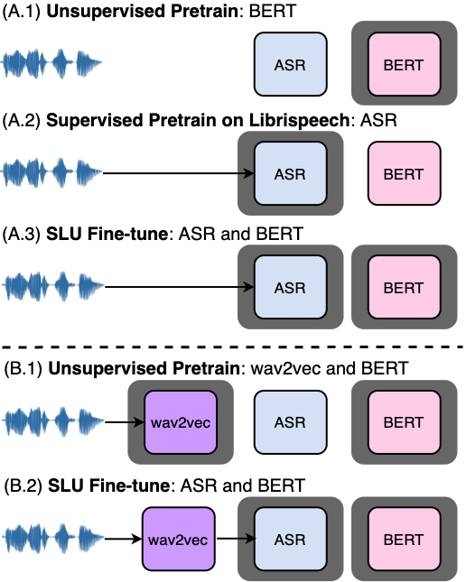

# Semi-Supervsied-Spoken-Language-Understanding

**UPDATED: The implementation of our end-to-end slot-filling will be merged into one of the downstream tasks in the [S3PRL toolkit](https://github.com/s3prl/s3prl). Stay tuned!**

This repository contains (PyTorch) code to reproduce the core results for our paper: 
* Semi-Supervised Spoken Language Understanding via Self-Supervised Speech and Language Model Pretraining (ICASSP 2021)

 

 

